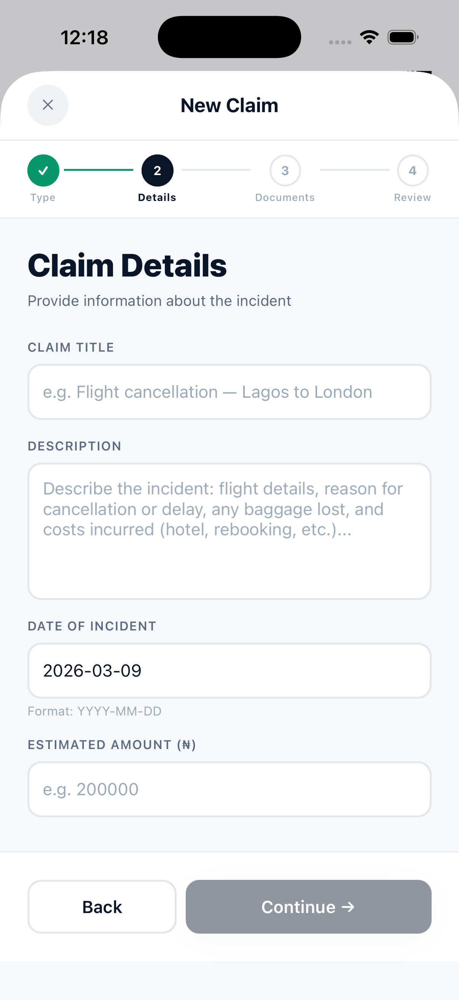

## ClaimTrack

A mobile insurance claims platform built with React Native, Expo, Firebase and Node.js.

## Overview

ClaimTrack allows insurance customers to submit claims, upload supporting documents, track claim status in real-time and communicate with claims adjusters all from a mobile app.

---

## Features

- Multi-step claim submission (Motor, Home, Health, Travel, Life)
- Document upload via camera or gallery with automatic compression
- OCR document scanning via Google Vision API
- Real-time claim status tracking with Firestore live listeners
- Biometric authentication (Face ID / Fingerprint)
- Offline draft saving with AsyncStorage sync
- JWT-authenticated Node.js REST API

---

## Tech Stack

| Layer | Technology |
|---|---|
| Mobile | React Native + TypeScript + Expo|
| State Management| Zustand |
| Backend | Node.js + Express + TypeScript |
| Database | Firebase Firestore |
| Storage | Firebase Storage |
| Auth | Firebase Authentication |
| OCR | Google Cloud Vision API |

---

## Demo

1. Register an account — a policy number is auto-assigned
2. Tap **New Claim** → select Motor → fill in incident details
3. Upload a photo of damage using camera or gallery
4. Submit — claim appears in real-time on the Claims tab
5. Tap the claim to view the status timeline